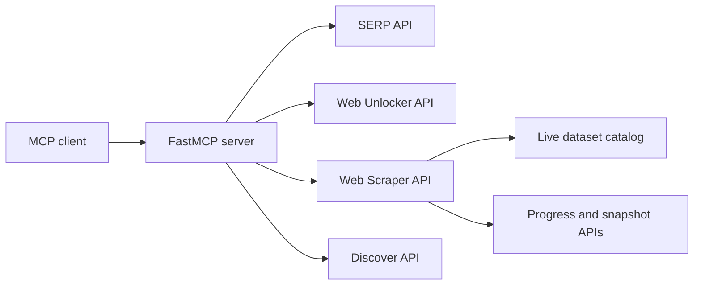

# Bright Data MCP Server

[](https://www.python.org/)
[](https://modelcontextprotocol.io/)
[](https://github.com/rakesh1308/brightdata-mcp-server/actions/workflows/ci.yml)
[](LICENSE)

A compact, self-hosted [Model Context Protocol](https://modelcontextprotocol.io/) server for Bright Data. It exposes nine tools for web search, anti-bot page retrieval, structured dataset scraping, asynchronous snapshot collection, and AI-ranked discovery.

The project demonstrates production-oriented API integration: live dataset resolution instead of stale IDs, validated request parameters, concurrent batch execution, async trigger/poll/download workflows, Streamable HTTP deployment, and contract-focused tests.

## Architecture



## Tools

| Tool | Purpose |
| --- | --- |
| `search_engine` | Search Google, Bing, or Yandex as parsed JSON or Markdown |
| `search_engine_batch` | Run up to 10 searches concurrently while preserving input order |
| `scrape_as_markdown` | Retrieve an unlocked page using Bright Data's native Markdown conversion |
| `scrape_as_html` | Retrieve the complete unlocked HTML response |
| `scrape_batch` | Retrieve up to 10 pages concurrently as Markdown |
| `discover` | Run AI-ranked public-web discovery with intent, date, locale, and keyword options |
| `scrape` | Run any collect-by-URL Web Scraper dataset synchronously or asynchronously |
| `scrape_poll` | Poll snapshot progress and download completed JSON, NDJSON, JSONL, or CSV results |
| `list_datasets` | Read and cache the live dataset catalog and available dataset IDs |

### Choosing the right tool

- Use `search_engine` when you need broad or recent search results.
- Use `scrape_as_markdown` when you need readable content from an arbitrary page.
- Use `scrape` when Bright Data has a structured scraper for the target site.
- Use `discover` for intent-ranked research. It is a separate account-gated product and is not a replacement for exhaustive vertical search.
- For job research, search for job URLs first and then pass those URLs to the appropriate structured dataset scraper.

## Quick start

Requirements: Python 3.11+ and a [Bright Data API key](https://brightdata.com/cp/setting/users).

```bash
git clone https://github.com/rakesh1308/brightdata-mcp-server.git
cd brightdata-mcp-server
python -m venv .venv
```

Activate the environment and install dependencies:

```bash
# macOS/Linux
source .venv/bin/activate

# Windows PowerShell
.venv\Scripts\Activate.ps1

python -m pip install -r requirements.txt
```

Create the local configuration:

```bash
# macOS/Linux
cp .env.example .env

# Windows PowerShell
Copy-Item .env.example .env
```

Set these values in `.env`:

| Variable | Required | Description |
| --- | --- | --- |
| `BRIGHTDATA_API_KEY` | Yes | API key from Bright Data account settings |
| `SERP_ZONE` | For search tools | Name of a configured SERP API zone |
| `WEB_UNLOCKER_ZONE` | For page tools | Name of a configured Web Unlocker API zone |
| `MCP_TRANSPORT` | No | `stdio`, `http`, or legacy `sse`; defaults to `stdio` locally |
| `MCP_HOST` | No | HTTP bind host; defaults to `0.0.0.0` |
| `MCP_PORT` | No | HTTP port; defaults to `8080` |
| `MCP_PATH` | No | Streamable HTTP path; defaults to `/mcp` |

Run locally over stdio:

```bash
python brightdata_mcp.py
```

## MCP client configuration

Use an absolute path to the script in your MCP client configuration:

```json
{
  "mcpServers": {
    "brightdata-custom": {
      "command": "python",
      "args": ["/absolute/path/to/brightdata-mcp-server/brightdata_mcp.py"]
    }
  }
}
```

For a remote deployment, connect the client to:

```text
https://your-service.example/mcp
```

## Dataset scraping

Dataset IDs can be passed directly, but friendly aliases are resolved against Bright Data's live catalog and cached for one hour:

```text
scrape(
  dataset="amazon_product",
  urls=["https://www.amazon.com/dp/PRODUCT_ID"]
)
```

Common aliases include `linkedin_profile`, `linkedin_jobs`, `linkedin_company`, `amazon_product`, `amazon_product_reviews`, `instagram_profile`, `tiktok_posts`, `reddit_posts`, and `crunchbase_company`.

Synchronous requests accept up to 20 URLs. Use `async_mode=True` for larger jobs, then pass the returned snapshot ID to `scrape_poll`.

## Testing

The test suite verifies all nine MCP tool contracts without spending API credits:

```bash
python -m unittest -v
python -m py_compile brightdata_mcp.py test_brightdata_mcp.py
```

Authenticated live smoke tests were also used during development to verify SERP, Web Unlocker, Discover, dataset catalog, synchronous scraping, and the complete async snapshot lifecycle.

## Deploying on Zeabur

The included [`Dockerfile`](Dockerfile) and [`zeabur.json`](zeabur.json) run the server over Streamable HTTP on port 8080.

1. Deploy this GitHub repository as a Docker service.
2. Add `BRIGHTDATA_API_KEY`, `SERP_ZONE`, and `WEB_UNLOCKER_ZONE` as service secrets.
3. Keep `MCP_TRANSPORT=http`, `MCP_HOST=0.0.0.0`, `MCP_PORT=8080`, and `MCP_PATH=/mcp`.
4. Verify `GET /health`, then initialize an MCP client at `/mcp`.

> [!IMPORTANT]
> The server authenticates outbound Bright Data requests, but it does not authenticate inbound MCP clients. Protect an internet-facing deployment with Zeabur access controls, an authenticated reverse proxy, or another trusted gateway. Otherwise, anyone who discovers the endpoint could consume the configured Bright Data account's credits.

## Security and secrets

- `.env` and common credential-file variants are excluded from both Git and Docker build context.
- Never put an API key in MCP client JSON committed to source control.
- Store production credentials in Zeabur's secret/environment-variable settings.
- If a key is exposed, revoke it in Bright Data immediately and replace it in every deployment.
- See [`SECURITY.md`](SECURITY.md) for vulnerability-reporting guidance.

## Billing notes

Eligible Bright Data accounts receive a shared monthly free-credit allowance for Web Unlocker, SERP, Web Scraper, and Scraper Studio. Discover is a separate account-gated API. Usage and product eligibility can change, so verify the current details in the [Bright Data free-tier documentation](https://docs.brightdata.com/general/account/billing-and-pricing/free-tier).

## Official documentation

- [Web Scraper API](https://docs.brightdata.com/datasets/scrapers/overview)
- [Synchronous scraper requests](https://docs.brightdata.com/api-reference/scrapers/synchronous-requests)
- [Asynchronous scraper requests](https://docs.brightdata.com/api-reference/rest-api/scraper/asynchronous-requests)
- [SERP API](https://docs.brightdata.com/scraping-automation/serp-api/introduction)
- [Web Unlocker API](https://docs.brightdata.com/scraping-automation/web-unlocker/introduction)
- [Discover API](https://docs.brightdata.com/api-reference/discover/overview)

## License

Released under the [MIT License](LICENSE).
