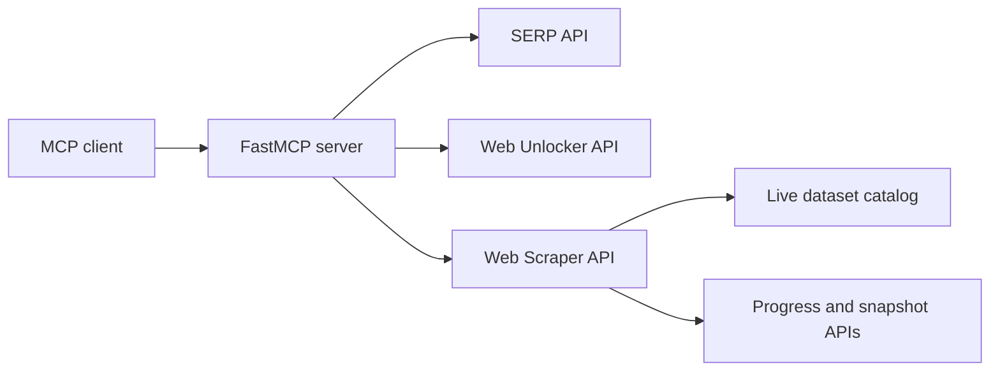

# Bright Data MCP Server

[](https://www.python.org/)
[](https://modelcontextprotocol.io/)
[](https://github.com/rakesh1308/brightdata-mcp-server/actions/workflows/ci.yml)
[](LICENSE)

A compact, self-hosted [Model Context Protocol](https://modelcontextprotocol.io/) server for Bright Data. It exposes eight tools for web search, anti-bot page retrieval, structured dataset scraping, and asynchronous snapshot collection.

The project demonstrates production-oriented API integration: live dataset resolution instead of stale IDs, validated request parameters, concurrent batch execution, async trigger/poll/download workflows, Streamable HTTP deployment, and contract-focused tests.

## Architecture



## Tools

| Tool | Purpose |
| --- | --- |
| `search_engine` | Search Google as parsed JSON or Bing/Yandex as Markdown, with geo targeting and pagination |
| `search_engine_batch` | Run up to 10 searches concurrently with per-query engine, geo, language, format, and cursor settings |
| `scrape_as_markdown` | Retrieve an unlocked page using Bright Data's native Markdown conversion |
| `scrape_as_html` | Retrieve the complete unlocked HTML response |
| `scrape_batch` | Retrieve up to 10 pages concurrently as Markdown |
| `scrape` | Run collectable Web Scraper datasets with URL shorthand or dataset-specific input objects |
| `scrape_poll` | Poll snapshot progress and download completed JSON, NDJSON, JSONL, or CSV results |
| `list_datasets` | Search and paginate the live account dataset catalog and current dataset IDs |

### Choosing the right tool

- Use `search_engine` when you need broad or recent search results.
- Use `scrape_as_markdown` when you need readable content from an arbitrary page.
- Use `scrape` when Bright Data has a structured scraper for the target site.
- For job research, search for job URLs first and then pass those URLs to the appropriate structured dataset scraper.

## Quick start

Requirements: Python 3.11+ and a [Bright Data API key](https://brightdata.com/cp/setting/users).

```bash
git clone https://github.com/rakesh1308/brightdata-mcp-server.git
cd brightdata-mcp-server
python -m venv .venv
```

Activate the environment and install dependencies:

```bash
# macOS/Linux
source .venv/bin/activate

# Windows PowerShell
.venv\Scripts\Activate.ps1

python -m pip install -r requirements.txt
```

Create the local configuration:

```bash
# macOS/Linux
cp .env.example .env

# Windows PowerShell
Copy-Item .env.example .env
```

Set these values in `.env`:

| Variable | Required | Description |
| --- | --- | --- |
| `BRIGHTDATA_API_KEY` | Yes | API key from Bright Data account settings |
| `SERP_ZONE` | For search tools | Name of a configured SERP API zone |
| `WEB_UNLOCKER_ZONE` | For page tools | Name of a configured Web Unlocker API zone |
| `MCP_TRANSPORT` | No | `stdio`, `http`, or legacy `sse`; defaults to `stdio` locally |
| `MCP_HOST` | No | HTTP bind host; defaults to `0.0.0.0` |
| `MCP_PORT` | No | HTTP port; defaults to `8080` |
| `MCP_PATH` | No | Streamable HTTP path; defaults to `/mcp` |
| `BRIGHTDATA_API_BASE_URL` | No | API origin override for testing; defaults to Bright Data's production API |

Zone names have no code defaults. They must match the zones configured in the deployed Bright Data account, preventing a deployment from silently using a stale or unrelated zone name.

Run locally over stdio:

```bash
python brightdata_mcp.py
```

## MCP client configuration

Use an absolute path to the script in your MCP client configuration:

```json
{
  "mcpServers": {
    "brightdata-custom": {
      "command": "python",
      "args": ["/absolute/path/to/brightdata-mcp-server/brightdata_mcp.py"]
    }
  }
}
```

For a remote deployment, connect the client to:

```text
https://your-service.example/mcp
```

## Dataset scraping

Dataset IDs can be passed directly, but friendly names are resolved entirely against Bright Data's live account catalog and cached for one hour:

```text
scrape(
  dataset="Amazon Products",
  urls=["https://www.amazon.com/dp/PRODUCT_ID"]
)
```

Datasets often enforce their own fields and URL patterns. Use `inputs` instead of `urls` when extra fields are required:

```text
scrape(
  dataset="google shopping",
  inputs=[{
    "url": "https://www.google.com/search?ibp=oshop&q=wireless+headphones",
    "country": "US"
  }]
)
```

Pass either `urls` or `inputs`, not both. If Bright Data rejects an input, the tool returns its validation body—including required fields or URL patterns—and an actionable hint. Validation failures are not automatically retried asynchronously because the same invalid input would fail again.

There is no hardcoded dataset-ID or alias registry. Names are normalized and ranked against the current catalog. Ambiguous names are rejected with the closest live matches instead of silently selecting the wrong scraper. Use `list_datasets(query="linkedin jobs")` to discover the exact current name and ID.

Synchronous requests accept up to 20 inputs. Use `async_mode=True` for larger jobs, then pass the returned snapshot ID to `scrape_poll`.

## Testing

The test suite verifies all nine MCP tool contracts and failure paths without spending API credits:

```bash
python -m unittest -v
python -m py_compile brightdata_mcp.py test_brightdata_mcp.py live_smoke_test.py
```

Run the authenticated end-to-end proof suite when you intentionally want to spend test requests:

```bash
python live_smoke_test.py
```

It exercises every tool, including Google and Bing search behavior, Web Unlocker Markdown/HTML/batch retrieval, the live dataset catalog, synchronous dataset scraping, and the complete async trigger/poll/download lifecycle. It prints pass/fail metadata only—never credentials or scraped content. Override `BRIGHTDATA_SMOKE_DATASET_NAME` and `BRIGHTDATA_SMOKE_INPUTS` to test another current scraper without changing code.

## Deploying on Zeabur

The included [`Dockerfile`](Dockerfile) and [`zeabur.json`](zeabur.json) run the server over Streamable HTTP on port 8080.

1. Deploy this GitHub repository as a Docker service.
2. Add `BRIGHTDATA_API_KEY`, `SERP_ZONE`, and `WEB_UNLOCKER_ZONE` as service secrets.
3. Keep `MCP_TRANSPORT=http`, `MCP_HOST=0.0.0.0`, `MCP_PORT=8080`, and `MCP_PATH=/mcp`.
4. Verify `GET /health`, then initialize an MCP client at `/mcp`.

> [!IMPORTANT]
> The server authenticates outbound Bright Data requests, but it does not authenticate inbound MCP clients. Protect an internet-facing deployment with Zeabur access controls, an authenticated reverse proxy, or another trusted gateway. Otherwise, anyone who discovers the endpoint could consume the configured Bright Data account's credits.

## Security and secrets

- `.env` and common credential-file variants are excluded from both Git and Docker build context.
- Never put an API key in MCP client JSON committed to source control.
- Store production credentials in Zeabur's secret/environment-variable settings.
- If a key is exposed, revoke it in Bright Data immediately and replace it in every deployment.
- See [`SECURITY.md`](SECURITY.md) for vulnerability-reporting guidance.

## Billing notes

Eligible Bright Data accounts receive a shared monthly free-credit allowance for Web Unlocker, SERP, Web Scraper, and Scraper Studio. Usage and product eligibility can change, so verify the current details in the [Bright Data free-tier documentation](https://docs.brightdata.com/general/account/billing-and-pricing/free-tier).

## Official documentation

- [Web Scraper API](https://docs.brightdata.com/datasets/scrapers/overview)
- [Synchronous scraper requests](https://docs.brightdata.com/api-reference/scrapers/synchronous-requests)
- [Asynchronous scraper requests](https://docs.brightdata.com/api-reference/rest-api/scraper/asynchronous-requests)
- [SERP API](https://docs.brightdata.com/scraping-automation/serp-api/introduction)
- [Web Unlocker API](https://docs.brightdata.com/scraping-automation/web-unlocker/introduction)

## License

Released under the [MIT License](LICENSE).
